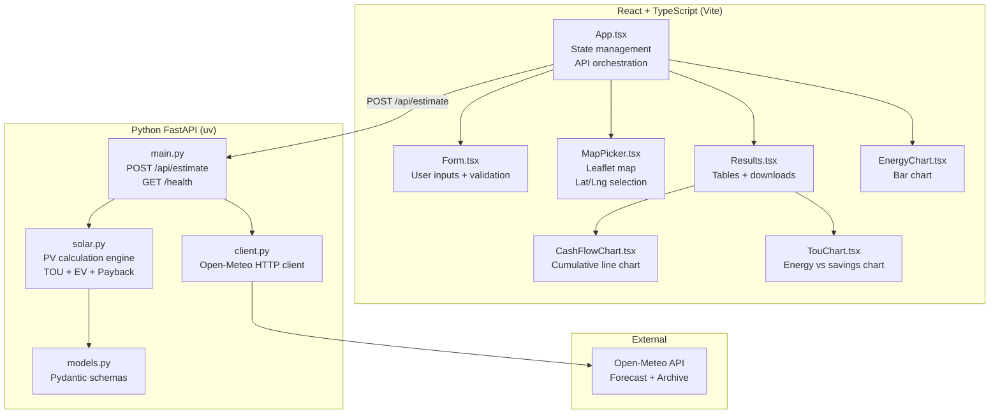
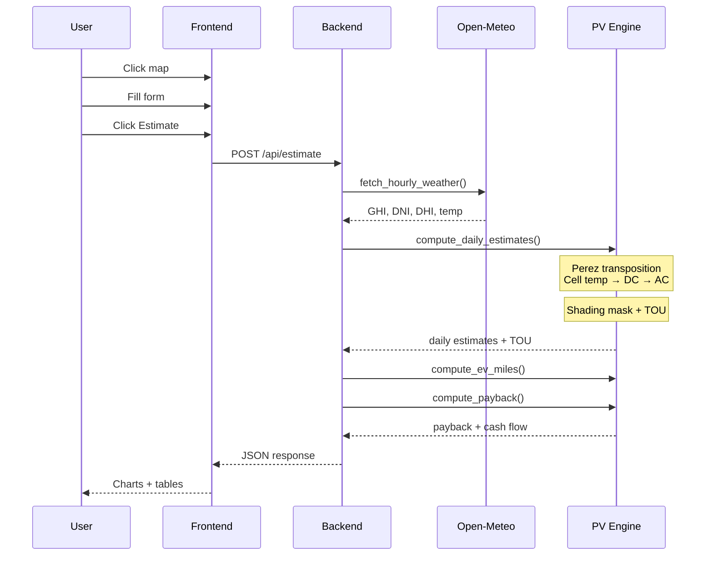
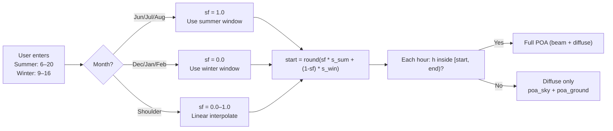
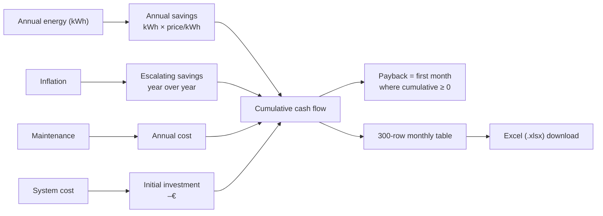
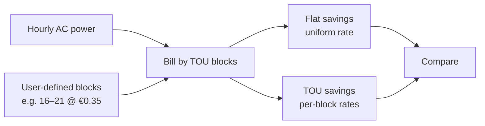

# Solarpanels — Application Overview

## Purpose
Web application that estimates the daily and total energy output (kWh) of a solar panel installation for a given location, date range, and panel configuration. Includes EV charging estimation, financial payback analysis, time-of-use (TOU) rate simulation, and seasonal shading.

---

## Architecture

---

## Data Flow

---

## PV Calculation Pipeline

```mermaid
flowchart LR
    A["Open-Meteo<br/>GHI · DNI · DHI · Temp"] --> B["Location + Time<br/>get_solarposition()"]
    B --> C["Surface Orientation<br/>Fixed / Vertical / Dual"]
    C --> D["POA Irradiance<br/>Perez transposition model"]
    D --> E{"Shading active?"}
    E -- Yes --> F["Zero beam component<br/>outside seasonal window"]
    E -- No --> G["Cell Temperature<br/>NOCT model"]
    F --> G
    G --> H["DC Power<br/>PVWatts DC model"]
    H --> I["System Losses<br/>soiling, wiring, mismatch"]
    I --> J["AC Power<br/>PVWatts inverter"]
    J --> K["Daily aggregation<br/>kWh per day"]
    K --> L["Total energy kWh"]
```

---

## Features

### 1. Location & Date
- Interactive **Leaflet map** — click anywhere to set latitude/longitude
- Free-form date range (past or future)
- Auto-selects Open-Meteo **Forecast API** (future) or **Archive API** (past)

### 2. Panel Configuration

| Mode | Description | Parameters |
|---|---|---|
| **Fixed** | Panels at a fixed tilt and azimuth | Tilt (°), Azimuth (° from N, 0–360) |
| **Vertical (E-W)** | Single-axis tracker, horizontal NS axis | Axis tilt (°) |
| **Dual-axis** | Full 2-axis tracking | None (automatic) |

**Defaults:** Area 1.6 m² · Efficiency 20% · System losses 14%

### 3. Seasonal Shading
- Define **summer** and **winter** time windows when the sun hits your panels
- Hours entered in **local time** (longitude-based UTC offset)
- Shoulder months (spring/autumn) **interpolate** between summer and winter windows
- Outside the window: beam (DNI) component is blocked — only diffuse light reaches the panel
- Automatically captures seasonal variation:
  - Summer: longer days, more energy lost outside the same clock window
  - Winter: shorter days, less absolute loss but higher relative impact

### 4. EV Integration
- Estimate how many **miles/km** your solar array can power an EV per year
- Built-in profiles (miles per kWh):

| Profile | mi/kWh |
|---|---|
| **Sedan** | 4.0 |
| **SUV** | 3.0 |
| **Truck** | 2.0 |
| **Custom** | User-defined |

- Consumption can be entered in **mi/kWh** or **kWh/100 km** (auto-converts)

### 5. Payback Calculator
- **System cost** (€) — upfront installation
- **Annual maintenance** (€) — recurring cost
- **Inflation rate** — for energy price escalation
- **Monthly bill** (€) — calculates bill coverage percentage
- Returns:
  - **Payback period** (years + months)
  - **25-year cumulative cash flow** chart
  - **Monthly cash flow table** (300 rows) with savings, maintenance, net, cumulative, bill coverage
  - **Year-1 bill coverage** — how much of your current bill is offset
  - **Excel download** for the full cash flow table

### 6. Time-of-Use (TOU) Rate Simulation
- Define **TOU blocks** with custom rates for peak hours
- Compare **flat-rate** savings vs **TOU** savings
- Breakdown per block: kWh consumed × rate
- Visual bar chart comparing energy vs savings per block

### 7. Excel Export
- **Daily estimates** table → `daily_estimates.xlsx`
- **Cash flow table** → `cash_flow.xlsx`
- Generated client-side with **SheetJS (xlsx)** library — no server round-trip

---

## Default Values

| Parameter | Default |
|---|---|
| Panel area | 1.6 m² |
| Efficiency | 20 % |
| System losses | 14 % |
| Electricity price | €0.12 / kWh |
| Inflation rate | 2.5 % |

---

## Data Source
**Open-Meteo** — free, no API key required:
- **Forecast API**: up to 16 days future, up to 92 days past
- **Archive API**: 1940 to present
- Automatic switching based on date range

---

## Tech Stack

| Layer | Technology |
|---|---|
| **Frontend** | React 19 + TypeScript, Vite, Leaflet, Chart.js, SheetJS |
| **Backend** | Python 3.12+, FastAPI, Pydantic V2 |
| **Solar engine** | pvlib-python (Perez transposition, PVWatts DC/inverter, NOCT) |
| **Package mgmt** | uv (Python), npm (frontend) |
| **Lint/type** | ruff, pyright, TypeScript |
